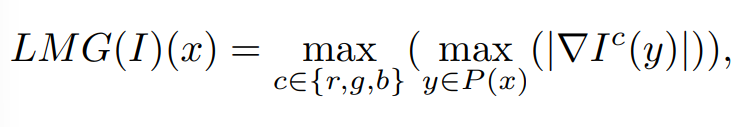
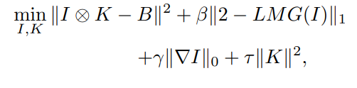

## citation
L. Chen, F. Fang, T. Wang, and G. Zhang, “Blind Image Deblurring With Local Maximum Gradient Prior,” in 2019 IEEE/CVF Conference on Computer Vision and Pattern Recognition (CVPR), Long Beach, CA, USA: IEEE, Jun. 2019, pp. 1742–1750. doi: 10.1109/CVPR.2019.00184.

## summary
Proposes a new LMG-based prior + regularization scheme for blind image deblurring with promising results when compared to SOTA algorithms.

## 1️⃣ first pass (abstract + introduction)
- Blind image deblurring aims to recover a sharp/clear image from a blurred one when the blur kernel is unknown (what parameters were used to blur it are unknown)
- This paper presents a blind deblurring method based on Local Maximum Gradient (LMG) prior
	- based on the idea that the maximum value of a local patch gradient will decrease after the blurring process
	- this inherent property of the blurring process allows us to establish a new energy function
- Linear operator to compute the LMG + optimization scheme
- If the blur kernel is space-invariant, we consider it as uniform blur
	- "space invariant" means that behavior/output does not change when the input image is translated in space. This means that the kernel should have equal effect everywhere in the image.
	- blurring process model is a convolution:
$B = I * K+ \epsilon$
- $B$ is blurry input
- $I$ is latent image (ground truth)
- $K$ is blur kernel
- $\epsilon$ is error/noise

NOTE: future readings in references: 
(1) optimization-based: 4. 23. 2. 27, 20
(2) learning-based: 24, 22, 17, 30, 25
(3) image prior-based: 16, 11, 21, 20, 28, 15

generated by ChatGPT { image priors" refer to pre-existing knowledge or assumptions about the characteristics and properties of images. These priors are used to guide algorithms in tasks such as image restoration, denoising, segmentation, and more. By incorporating image priors, algorithms can produce better results, especially when dealing with noisy, incomplete, or ambiguous data. Examples:

1. **Smoothness Priors:**
    
    - **Assumption:** Natural images tend to have regions where pixel values change gradually rather than abruptly.
    - **Use Case:** Denoising algorithms often assume that the image is mostly smooth and use this prior to remove noise while preserving important edges.
2. **Edge Priors:**
    
    - **Assumption:** Edges in an image (where there is a significant change in intensity) are important features.
    - **Use Case:** Algorithms might prioritize preserving edges when performing tasks like super-resolution or inpainting.
3. **Texture Priors:**
    
    - **Assumption:** Certain textures are common in natural images (e.g., grass, sky, brick walls).
    - **Use Case:** Texture priors can be used in tasks like texture synthesis or inpainting to ensure that synthesized regions look realistic.
4. **Sparsity Priors:**
    
    - **Assumption:** Many natural images can be represented using a small number of non-zero coefficients in some transformed domain (e.g., wavelet or Fourier domain).
    - **Use Case:** Sparsity priors are widely used in compressed sensing and image reconstruction techniques.
5. **Statistical Priors:**
    
    - **Assumption:** The distribution of pixel intensities in natural images follows certain statistical patterns.
    - **Use Case:** This can be used in algorithms like Markov Random Fields (MRFs) for tasks like segmentation or image restoration.
6. **Structural Priors:**
    
    - **Assumption:** Images often have repetitive structures or patterns.
    - **Use Case:** Structural priors are useful in tasks like image completion, where the goal is to fill in missing parts of an image by leveraging the repetitive nature of structures.
}

- This paper proposes a new blind deblurring framework based on LMG prior
	- After the blurring process, the maximum gradient value of a local patch will diminish --> incorporate this into a sparse-based energy function
	- enforce an $L_1$ norm to the LMG involved term which favors clear images over blurred ones during the iteration steps
	- non-linear optimization scheme --> our algorithm performs well on both synthetic and real datasets

- contributions:
	- presented a new image prior termed LMG and mathematically proved why it works during deblurring
	- adopted $L_1$ norm on the LMG-involved term + provided an effective optimization scheme for the energy function
	- method performed well on synthetic datasets (13, 9, 12) and real images against SOTA algorithms

- $x$ and $y$ denote pixel locations in the image
- $P(x)$ is the image patch centered at $x$ 
- $c$ is the color channel which belongs to set $\{r, g, b\}$
- $\nabla$ is gradient operator in two dimensions

### proposed model
- energy function:

### results + analysis
- sharper edges, fewer artifacts
- something that I noticed was that many of the pictures they used to show how their algorithm is better tend to have something light with a dark background. I wonder how this algorithm puts up with light on light, dark on dark, etc. 
- LMG prior alone is not able to handle deblurring
