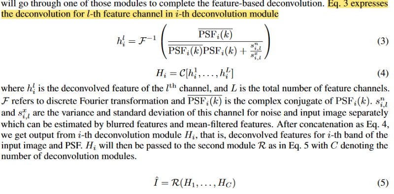

# citation
H. Wang, Y. Lin, A. Slosar, S. Sreejith, N. Ramachandra, and S. Yoo, “Deconvolution of Astronomical Images with Deep Neural Networks”.

# summary

# notes

# 1️⃣ first pass (abstract + information)
- optical astronomical images are affected by the point spread function PSF of the optical system and the atmospheric conditions which blur the observed image
- blurring depends on the observed band and the atmospheric conditions during observation
- a typical astronomical image will have a unique PSF that is non-circular and different in different bands
- observations of known stars give us an estimation of PSF
- analysis of astronomical images must take the known PSF into account during image analysis
- NEED FOR THIS PAPER: majority of applications of NN to astronomical image deconvolution in the past have ignored this problem by assuming fixed PSF
- **this paper presents a neural network architecture based on Deep Wiener Deconvolution Network (DWDN) that takes the PSF into account when performing deconvolution**
	- employs two regularization schemes and custom loss functions that are optimized for relevant astronomical features
- **results: this algorithm can successfully recover unbiased image properties such as colors, ellipticities and orientations for sufficiently high signal-to-noise**
- this paper is exceptional because it is a comprehensive application of AI in astronomy; everything is tailor-made to fit the domain problem (astronomy)

- large telescopes and big data sets are bringing about change in astronomical survey science
- resolution of space-based telescopes is limited by diffraction, whereas resolution of ground-based telescopes is limited by seeing
	- seeing is the distortion of the image caused by the disturbance of an optical 
	- wavefront as it passes through a turbulent atmosphere, resulting in a finite PSF
	- ground-based surveys often do not employ adaptive optics due to the large field of view, resulting in a non-zero PSF
- PSF is:
	- variable because the atmosphere changes in size, shape, and orientation every second; thus, the PSF is asymmetric and different in different bands
	- known in each exposure because each exposure contains stars that are known point sources, which can then be analyzed to determine the PSF --> *lowkey very skeptical about this; how can this be true for every exposure?* 🤔 *feels like a copout*
	- recovery of an object's shape, position, flux, and other intrinsic parameters in the presence of noise and varying PSF is the goal of astronomical image analysis
	- ML techniques using convolutional operations are promising avenues for speeding up the astronomical processing
		- many of these deal with galaxy deblending (INSERT LINKS)
			- however, still make the assumption of constant PSF and sweep it under the rug by saying that several training sets can be provided, one for each PSF. However, this is an unlikely occurrence because
		- others deal with:
			- blending
			- masking
			- modeling various detector artifacts
	- this paper deals with leveraging PSF information to build a network that deconvolves a noisy, convolved input image to produce the true image of the galaxy at the resolution supposed by the PSF
# 2️⃣ second pass
- we use a linear model for the observed astronomical image: convolution with PSF followed by addition of observational noise:

$I_i = I_{gt,i} * PSF_i + N_i$
- Where $I_i$ is the messed up image
- $I_{gt,i}$ is the ground truth image
- $PSF_i$ is the point-spread function
- $N_i$ is noise
🤔 this model is flawed because 
- noise is assumed to be homogeneous and normally distributed
- brighter-fatter effects, amplifier non-linearities, and other detector phenomena make this transformation weakly non-linear --> this model is making a lot of assumptions!
- PSF also varies across the focal plane, but this work assumes that the region of interest is always small enough so that the PSF can be assumed constant (*i thought you just said that other works are bad because they assume constant PSF*)   --> *i think other papers assumed constant PSF over entire training set, whereas this one assumes constant PSF over singular training example because of small region of interest*
- one of the classic regularization technique for deconvolution is the Wiener Deconvolution formulated in the Fourier space:
	$WD = \frac{P_s(k)}{{P_s(k) + P_n(k)PSF^{-2}(k)}}PSF^{-1}(k)$ 
	where:
	- $P_s(k)$ is spectral density of signal 
	- $P_n(k)$ is spectral density of noise
A neural network extension of the above formula is the DWDN (?) (need to review how neural networks work)
- DWDN is a brand new solution for non-blind image deblurring problems
- Instead of deconvolution in the image space like existing methods, DWDN applies Wiener Deconvolution explicitly in the feature space
- Achieves outstanding results with fewer artifacts (residue/anomalies)
- DWDN consists of:
	- feature-based Wiener deconvolution module: carries out deconvolution process
	- multi-scale feature refinement module: restores high-quality images using features from the previous module
- one restriction of DWDN is that for galaxy images, different bands have different PSFs. However, the feature maps extracted from the input have already been mixed up and no longer have distinguishable bands as the image does
	- this paper proposes an enhanced version of DWDN that can work on band-dependent PSFs
	- to apply feature-based deconvolution on different input bands separately, we parallel three deconvolution modules (this number is variable based on the number of bands)

We keep the refining module R the same way except the number of channels of its input feature is C times as original DWDN because of the concatenation. In this way, different bands of the input image will execute their own deep Wiener deconvolution and the deconvolved features are utilized to restore the clean images (in all bands?).

![[paper4_deconvolution_modules_diagram.png]]

### custom loss function
- majority of image analysis papers use cookie-cutter loss functions, but are not domain-specific
- in astronomy, we are interested in particular properties of the output image; particularly, object brightness, position, and shape --> it is important to include them into the loss function so that the neural network can focus explicitly on those values

![[paper4_quantities_of_interest.png]]

### training procedure and loss function
- training occurs in two phases:
	- first phase: model is pre-trained to deblur and produce reasonable prediction as output
	- second phase: model is fine-tuned with more complex loss which include astronomical quantities 
	In other words, model needs to be pre-trained generally first, then with the more domain-specific loss function in order to get best results.

	![[paper4_quantities_of_interest.png]]

### data
- dataset used was WeakLensingDeblending package developed by LSST Data Management
- FixedGalaxyCatalog provided composite exponential galaxy images of single galaxy with g, r, and i bands with single exposures per band and Gaussian PSFs that vary across the different bands (🤔 does SDSS have this?)
	- one training example includes: noisy image, ground truth image, PSF image, each for three different bands
	- shear is 0 (?) (what is shear? --> transformation which changes the shape of object)
	- signal-to-noise cutoff is > 10
	- used 100,000 images with constant dimensions of 35 x 35 x 3; training set is 90,000 images and test is 10,000 (🤔 is this not a weird ratio? Would this model be susceptible to overfitting?)
	- they resized and normalized each image (🤔 why?); during testing, in order to get the accurate performance of the model, the prediction from the network is rescaled back by exactly the same factor to be able to directly compare it to the ground truth image (🤔 so why rescale anyways? Is it because deconvolution has certain size requirements?))
### evaluation + results
- used Adam optimizer, batch size 128 (🤔 how do you decide this?)
- first phase lasts for 80 epochs with learning rate 0.0001
- second phase lasts for 10 epochs with learning rate 0.00001
- to evaluate performance, 4 different models are trained as comparison
- requires 25.5 hours on NVIDIA V100 GPU with 32GB memory

- testing data is divided into three categories based on signal-to-noise ratio (low, medium, high)
- metrics used for evaluation include: peak signal-to-noise-ratio, structural similarity index to compare with ground truth images
	- values are averaged over three bands
- quality of predictions does not depend too much on the accuracy of PSF (surprisingly)

### uncertainty
- paper has a lot of discussion on uncertainty don't fully understand this. Will come back to it if required.
